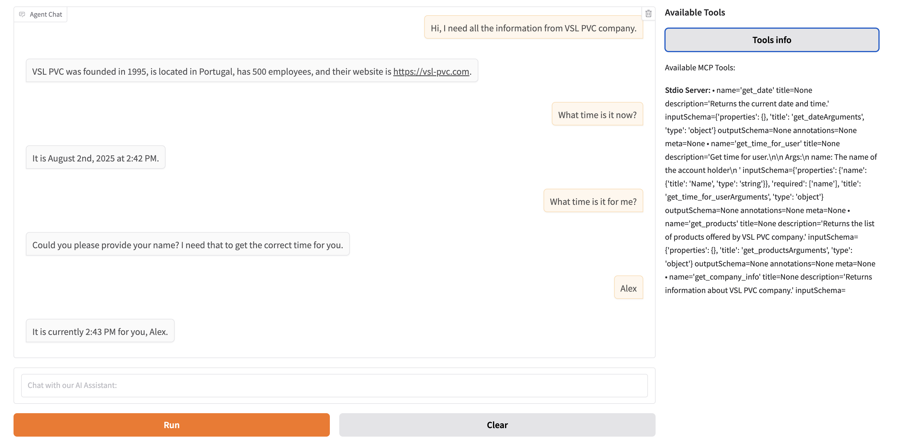

# MCP Agent Chat

A configurable web-based chat interface designed for developers to test and interact with Model Context Protocol (MCP) agents. Supports multiple AI models (OpenAI, Ollama, LM Studio), both local stdio and remote HTTP MCP servers, with a clean UI and flexible JSON configuration system.

## Quick Start

1. **Update configuration**: Edit `config.json` to match your AI model setup (OpenAI, Ollama, LM Studio, etc.)

2. **Start MCP servers** (if using external servers):
   ```bash
   PORT=3011 node examples/js/books_server.js
   ```
   >**Note**: For first-time setup, see [books_server readme](examples/js/MCP_README.md)

3. **Run the application**:
   ```bash
   uv run run_chat.py
   ```

4. **Access the web interface** at `http://localhost:7860`

> **Note**: For first-time setup, see the [Installation](#installation) section below.

## Features

- **Configurable AI Models**: Support for OpenAI, Ollama, LM Studio, and other OpenAI-compatible APIs
- **Multiple MCP Servers**: Connect to both stdio and HTTP MCP servers
- **Web Interface**: Clean Gradio-based chat interface
- **Environment Variables**: Secure API key management
- **Extensible Configuration**: JSON-based configuration system


*Web interface for chatting with MCP-enabled AI agents*

## Project Structure

```
.
├── config.json           # Main configuration file
├── config_openai.json    # OpenAI configuration example
├── config_lmstudio.json  # LM Studio configuration example
├── config_manager.py     # Configuration management
├── managers.py          # MCP, Model, and Agent managers
├── mcp_chat.py          # Main chat interface application
├── run_chat.py          # CLI launcher with config selection
├── test_mcp_agent.ipynb # Original notebook
├── examples/
│   ├── js/
│   │   ├── books_server.js       # Books MCP server (HTTP)
│   │   ├── package.json          # Node.js dependencies
│   │   └── MCP_README.md         # JavaScript MCP documentation
│   └── py/
│       ├── date_mcp_server.py    # Date/time MCP server
│       └── pvc_company.py        # Company info MCP server
├── pyproject.toml       # Project dependencies
└── README.md           # This file
```

## Installation

### Prerequisites

This project uses uv (recommended):
```bash
curl -LsSf https://astral.sh/uv/install.sh | sh
```

### Setup Steps

1. **Clone the repository** (if not already done)

2. **Set up the environment**:
   ```bash
   uv venv
   source .venv/bin/activate
   ```
   > **Notes:** `deactivate`

3. **Install dependencies** using uv:
   ```bash
   uv sync
   ```

4. **Set up environment variables** (if using OpenAI):
   ```bash
   echo "OPENAI_API_KEY=your_openai_api_key_here" > .env
   ```

> **Command Usage**: This documentation uses `uv run` for executing Python scripts, which is the recommended approach when using uv for dependency management. You can substitute `python` for `uv run` in any command if you prefer or are using a different Python environment setup.

## Configuration

The application is configured via `config.json`. Here are examples for different setups:

### Ollama Configuration (Default)

```json
{
  "model": {
    "name": "llama3.2",
    "provider": "ollama",
    "url": "http://localhost:11434/v1",
    "api_key": "ollama"
  },
  "mcp_servers": [
    {
      "type": "stdio",
      "command": "uv",
      "args": ["run", "examples/py/date_mcp_server.py"],
      "timeout": 120
    }
  ]
}
```

### OpenAI Configuration

```json
{
  "model": {
    "name": "gpt-4o-mini",
    "provider": "openai",
    "api_key": "OPENAI_API_KEY"
  },
  "mcp_servers": [
    {
      "type": "stdio",
      "command": "uv",
      "args": ["run", "examples/py/date_mcp_server.py"],
      "timeout": 120
    }
  ]
}
```

### LM Studio Configuration

```json
{
  "model": {
    "name": "gemma-3-12b",
    "provider": "lm-studio",
    "url": "http://localhost:1234/v1",
    "api_key": "lm-studio"
  },
  "mcp_servers": [
    {
      "type": "stdio",
      "command": "uv",
      "args": ["run", "examples/py/date_mcp_server.py"],
      "timeout": 120
    }
  ]
}
```

## Configuration Options

### Model Configuration

- **name**: Model name/identifier
- **provider**: Provider type (openai, ollama, lm-studio, etc.)
- **url**: API endpoint URL (optional for OpenAI)
- **api_key**: API key or environment variable name (uppercase names are treated as env vars)

### MCP Servers

#### Stdio MCP Server
```json
{
  "type": "stdio",
  "command": "uv",
  "args": ["run", "path/to/server.py"],
  "timeout": 120
}
```

#### HTTP MCP Server
```json
{
  "type": "http",
  "url": "http://localhost:3011/mcp",
  "timeout": 120
}
```

### Chat Configuration

```json
{
  "chat": {
    "max_turns": 30,
    "agent_name": "Assistant",
    "agent_instructions": "You are a helpful assistant with shortly answering questions."
  }
}
```

### UI Configuration

```json
{
  "ui": {
    "title": "MCP Agent Chat",
    "height": 500,
    "placeholder": "Chat with our AI Assistant:",
    "launch_browser": true,
    "share": false,
    "server_name": "127.0.0.1",
    "server_port": 7860
  }
}
```

## Usage

### Running the Application

1. **Start your AI model server** (if using local models):
   - For Ollama: `ollama serve`
   - For LM Studio: Start LM Studio and load a model

2. **Run the chat interface**:

   **Option A: Using the CLI launcher (recommended)**
   ```bash
   uv run run_chat.py
   ```
   
   **Option B: With a specific configuration**
   ```bash
   uv run run_chat.py --config config_openai.json
   ```
   
   **Option C: List available configurations**
   ```bash
   uv run run_chat.py --list-configs
   ```
   
   **Option D: Direct execution**
   ```bash
   uv run mcp_chat.py
   ```

   > **Note**: You can also use `python` instead of `uv run` if you prefer or if you're working with a different Python environment setup.

3. **Access the web interface** at `http://localhost:7860`

### CLI Launcher (`run_chat.py`)

The `run_chat.py` script provides a convenient command-line interface for starting the MCP Agent Chat with different configurations:

**Features:**
- **Configuration Selection**: Choose different config files
- **Validation**: Checks if config files exist before starting
- **Status Display**: Shows model and server information on startup
- **Error Handling**: Clear error messages and help

**Usage Examples:**

```bash
# Run with default config.json
uv run run_chat.py

# Run with OpenAI configuration
uv run run_chat.py --config config_openai.json

# Run with LM Studio configuration  
uv run run_chat.py --config config_lmstudio.json

# List all available configurations
uv run run_chat.py --list-configs

# Get help
uv run run_chat.py --help
```

> **Note**: You can also use `python` instead of `uv run` for any of these commands.

**Why use `run_chat.py` instead of `mcp_chat.py` directly?**
- **Easier configuration switching** between different AI providers
- **Built-in validation** to catch configuration errors early
- **Better error messages** when something goes wrong
- **Status information** showing what model and servers are being used

> **Note**: All commands in this documentation use `uv run` but can be replaced with `python` if preferred.

### Testing MCP Servers

The application includes example MCP servers for testing:

1. **Date/Time Server** (`examples/py/date_mcp_server.py`):
   - Try: "What time is it now?" 
   - Try: "What time is it for me?" (requires name "Alex"). Here we test how the MCP server interacts with the user.

2. **Company Info Server** (`examples/py/pvc_company.py`):
   - Try: "What is the website of the VSL PVC company?"
   - Try: "What products does VSL PVC offer?"
   - Try: "Hi, I need all the information from VSL PVC company."

## Local LLM Setup

### LM Studio
```bash
lms server start
lms server stop
```

### Ollama
```bash
ollama run llama3.2
```

## Testing External MCP Servers
```bash
PORT=3011 node examples/js/books_server.js
```

## Development

### Adding New MCP Servers

1. Create your MCP server following the MCP specification
2. Add it to the `mcp_servers` array in `config.json`
3. Restart the application

### Customizing the Interface

Modify `mcp_chat.py` to customize:
- UI layout and styling
- Chat behavior
- Additional features

### Environment Variables

Use environment variables for sensitive data:

```bash
# .env file
OPENAI_API_KEY=your_openai_api_key
ANTHROPIC_API_KEY=your_anthropic_api_key
```

Then reference them in config.json with uppercase names:
```json
{
  "model": {
    "api_key": "OPENAI_API_KEY"
  }
}
```

## Troubleshooting

### Common Issues

1. **Connection Errors**:
   - Ensure your AI model server is running
   - Check the URL and port in configuration
   - Verify API keys are correct

2. **MCP Server Errors**:
   - Check that MCP server scripts exist
   - Ensure dependencies are installed
   - Verify command paths in configuration

3. **Import Errors**:
   - Run `uv sync` to install dependencies
   - Check Python environment

### Debugging

1. **Enable verbose output** by modifying the print statements in `mcp_chat.py`
2. **Check MCP server tools**:
   - Click "List Tools" button in the interface
   - Check console output for available tools

### Testing MCP Servers Manually

Use the MCP inspector to test servers:

```bash
npx @modelcontextprotocol/inspector
```

Then configure:
- Command: `uv`
- Arguments: `run examples/py/date_mcp_server.py`

### Look at the trace

* https://platform.openai.com/traces
* https://www.stainless.com/mcp/how-to-test-mcp-servers

## API Reference

### CLI Launcher

```bash
# Basic usage
uv run run_chat.py

# With specific config
uv run run_chat.py --config my_config.json

# List available configs
uv run run_chat.py --list-configs
```

> **Note**: You can also use `python` instead of `uv run` for any of these commands.

### Config Manager

```python
from config_manager import Config

config = Config("config.json")
print(config.model_name)
print(config.api_key)
```

### Managers

```python
from managers import MCPServerManager, ModelManager, AgentManager

# Initialize managers
mcp_manager = MCPServerManager(config)
model_manager = ModelManager(config)
agent_manager = AgentManager(config, model_manager, mcp_manager)

# Connect to servers
await mcp_manager.connect_all()

# Create agent
agent = await agent_manager.create_agent()
```

### Chat Interface

```python
from mcp_chat import MCPChatInterface

interface = MCPChatInterface("config.json")
interface.launch()
```